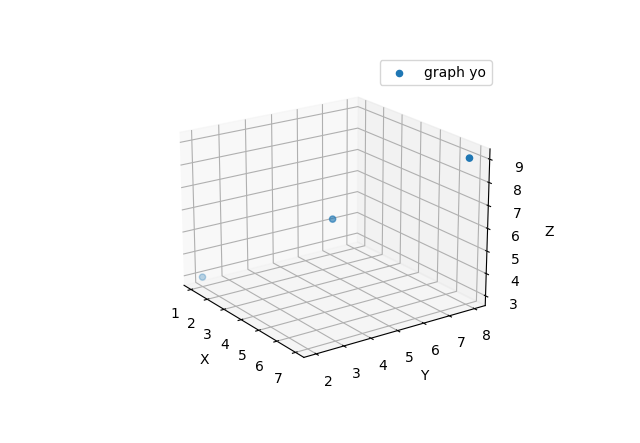

# What is this
Just a a collection of templates for matplotlib.
For the purpose of refrence so that i don't have
to look up the common stuff each time i use 
matplotlib.

## 3d-scatter.py
takes input from standard in. input should be a 
number of lines where each line has the format

> <DECIMAL NUMBER>, <DECIMAL NUMBER>, <DECIMAL NUMBER>

the three numbers will be interpreted as the x, y and z
coordinates respectively of a point in 3d space. Each 
line will be displayed as a point in a scatter plot.

Code is a modified version of [this example](https://matplotlib.org/stable/gallery/mplot3d/2dcollections3d.html#sphx-glr-gallery-mplot3d-2dcollections3d-py) 
from the official matplotlib website.

As an example; the following input,

> 1, 2, 3
> 4, 5, 6
> 7, 8, 9

gives a graph that looks like

